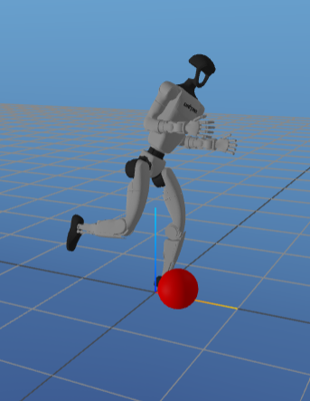

# Unitree G1 Humanoid ball Kicking

This project was completed as part of the Optimal Control and Reinforcement Learning Course at Carnegie Mellon University. \
We used direct collocation to generate an optimal trajectory for a Unitree G1 Humanoid to kick a ball at a target, and \
used inifinte-horizon and time-varying LQR to balance the robot and track the desired kicking trajectory. Note that there \
is an initial balancing period prior to the kicking motion.

## Full-Speed Video
[Video](https://drive.google.com/file/d/1Anm-PQDVrlT_3DAqsTWmSxrEJd11BrYt/view?usp=sharing)

## Slo-Mo Video (1/10 Speed)
[Video](https://drive.google.com/file/d/1aFUna-hNU-9kaRbgaetrFXdllspUzQgw/view?usp=sharing)

## Report:
[Report Link](https://drive.google.com/file/d/1GU4XM4nMZlzUPQYEkmTB_TG7RNC7VwWu/view?usp=drive_link)

